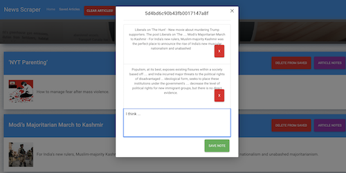

# News Scraper  - New York Times

This program is using **MongoDb** and **Cheerio** to scrape New York Times headline news. The Title, Summary and photo (if there is one) can be saved for future review. You can click "saved" to review then saved articles and leave notes. All the notes will be permanently saved in MongoDb database until user deletion. When you click "clear articles" button, all unsaved articles would be deleted from the database.

Test the program here:
[https://secret-springs-94075.herokuapp.com/](https://secret-springs-94075.herokuapp.com/)

